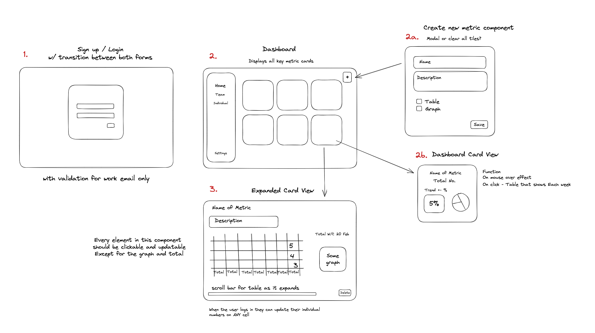

# 📈 Metrics Dashboard
For Project #4: React Application @ General Assembly

Welcome to my project, here is a link to [my app]()!
- Link to [GA Gist](https://gist.git.generalassemb.ly/katie/d4c2013a89a9a3da9650cc6c5851b07f) - Project Brief
- Link to [my Miro Board](https://miro.com/app/board/uXjVPlVqlbw=/) - Login and User Flow
- Link to [Trello Board](https://trello.com/b/2TsOmtxS/metrics-dashboard) - Project Management
- Link to [Notion](https://clarencearimado.notion.site/Design-Inspiration-for-Metrics-Dashboard-40b84e72a8e846808b2e24c25d4430e4) - Design Inspiration

---

## Description
To develop a metrics dashboard for all users to update tables to be reported by me to my Director by the end of each week.

Why?
- To understand and share trends (WoW comparisons)
- A solution to a real problem at work

Tech:
- **Front-end**
    - React
        - ReactRouter (2 paths)
        - Jest
    - Data Visualisation
        - [React-Vis](https://uber.github.io/react-vis/) - Charting Library
    - CSS
        - [Material UI](https://mui.com/)
        - Styled Components
            - yarn add styled-components
        - EXTRA - Tailwind CSS
            - yarn add tailwindcss
        - EXTRA [Framer Motion](https://www.framer.com/motion/examples/)
- **Back-end**
    - Firestore Firebase
        - Database & Auth

---

### MVP
- A working application, hosted
- 2 URL Paths - Dashboard and Login/Signup
- Card components (CRUD)

---

## User Stories
- All users can create account
- As normal users, can read and update cards
- As admin user, can create, read, update and delete cards
- When a card component is to be created, there should be an option to highlight if team or individual metric
    - Table layout will remain the same between individual and team 
- All users can add AND delete rows and columns and edit their respective row
- Each metric is a card component - CRUD
    - Users can click a button and a new card is created on the dashboard
    - Each card on dashboard will show latest data only (% variance WoW) <- this is the TEAM total   
    - When the card is clicked, all other cards are hidden and the card is expanded
    - The expanded card shows a table and users can edit their corresponding rows
    - Admin can only delete cards
- As a user, I should be able to login, be presented with dashboard insights immediately

---
## Project Plan

[✓] Ideation and Planning
- User Stories & Features
- Create Wireframes
- Design Inspiration and Mockups

[] Stage 1 - Data Planning
- Design Table Schema
- Firestore Firebase
- SQL Commands

[] Stage 2 - Developing Basic Functionality
- Navbar Component
- Card Component (Collapsed and Expanded) Functionality
- User Input to DB
- Login and Logout Form & Routes

[] Stage 3 - Basic Styling of Components
- Navbar Styled
- Card Collapsed Styled
- Dashboard Styled

[] Stage 4 - Developing Main Functionality and Working with Data
- Card Expanded - Table
- Display User Input to Table

[] Stage 5 - Finish Styling
- Finalise Style
- Add Card Hover Effects and Transitions
- Login/Logout Transition

[] Extensions
- Responsive Design
- Export data as .pdf, .csv?
- Light/Dark mode
- Framer Motion for animations and transitions 

---
## User Flow

---